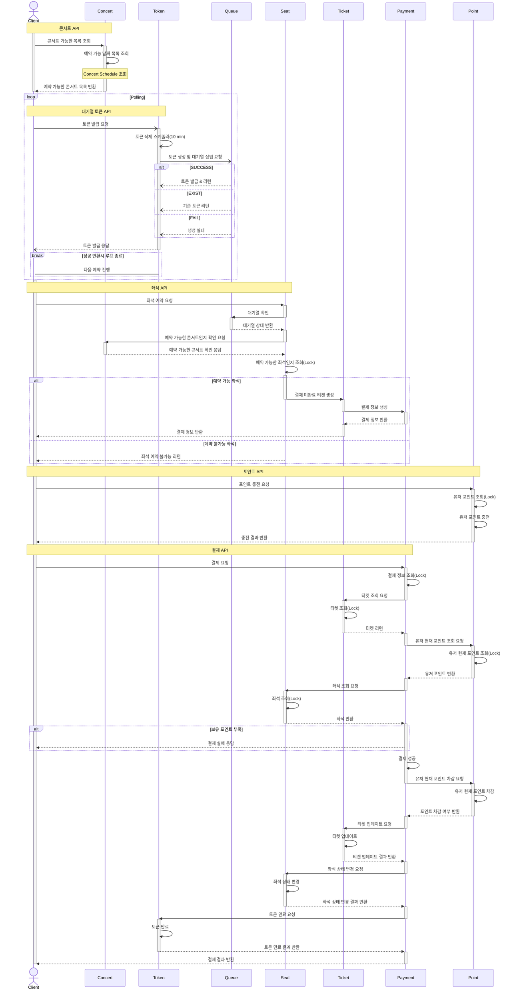
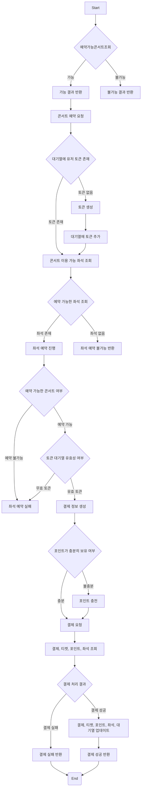
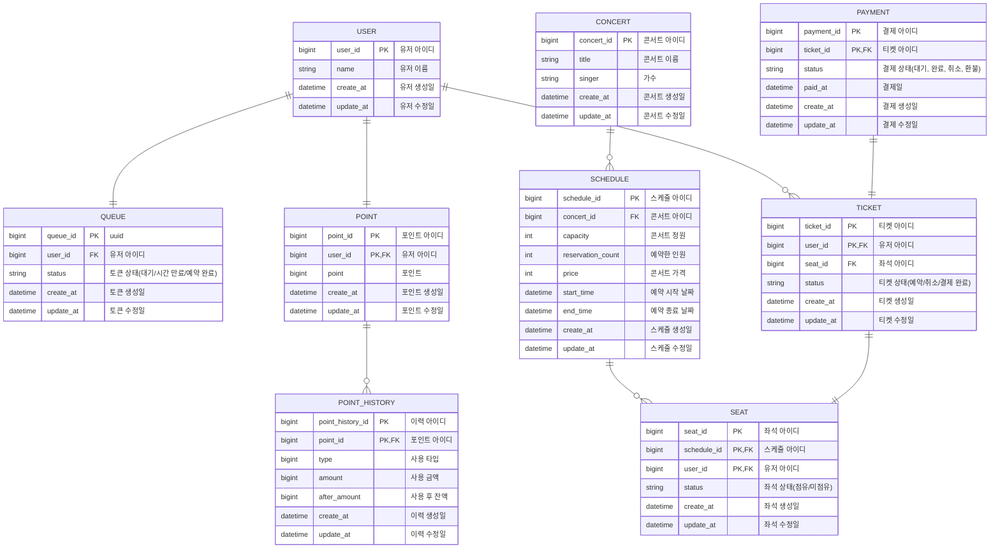

# hhplus-concert-server

항해99 벡엔드 플러스 서버 구축 과제

## 🧰 Info

- 시나리오: 콘서트 예약 서비스
  - 대기열을 이용한 시스템 구축
  - 대기열, 좌석 예약, 포인트 이용 등 주요한 기능
- 일자: 2024.10.04 -
- 기술 스택:
  - Java 21
  - Postgresql 16.3
  - Spring Boot 3.3.4

## 🔖 목차

1. [Milestone](https://github.com/nashs789/hhplus-concert-server/tree/step05?tab=readme-ov-file#-milestone-%EB%B0%94%EB%A1%9C%EA%B0%80%EA%B8%B0)
2. [Timeline](https://github.com/nashs789/hhplus-concert-server/tree/step05?tab=readme-ov-file#%EF%B8%8F-timeline-%EB%B0%94%EB%A1%9C%EA%B0%80%EA%B8%B0)
3. [Sequence Diagram](https://github.com/nashs789/hhplus-concert-server/tree/step05?tab=readme-ov-file#-sequence-diagram)
4. [Flow Chart](https://github.com/nashs789/hhplus-concert-server/tree/step05?tab=readme-ov-file#-flow-chart)

---

## 🪧 Milestone [[바로가기]](https://github.com/nashs789/hhplus-concert-server/milestones)

## ⏲️ Timeline [[바로가기]](https://github.com/users/nashs789/projects/4/views/5)

## 📕 Sequence Diagram

## 📗 Flow Chart

## 🗃️ ERD

