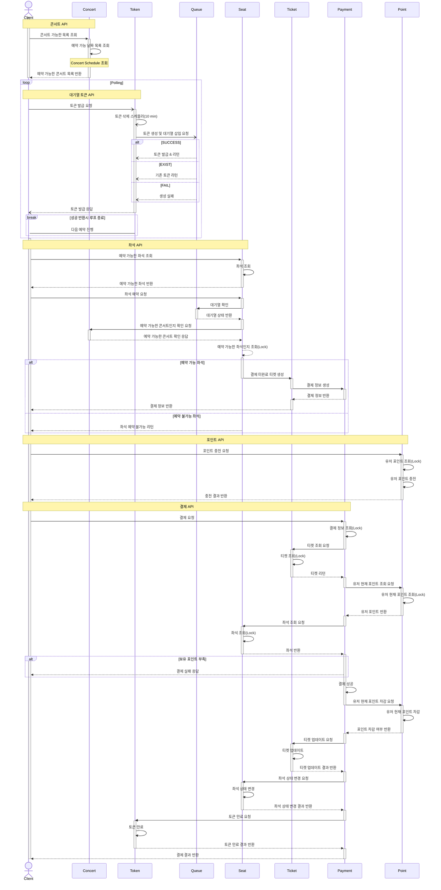

```mermaid
sequenceDiagram
    actor Client
    participant Concert
    participant Token
    participant Queue
    participant Seat
    participant Ticket
    participant Payment
    participant Point

    activate Client
    Note over Client, Concert: 콘서트 API
    Client ->>+ Concert: 콘서트 가능한 목록 조회
    Concert ->> Concert: 예약 가능 날짜 목록 조회
    Note over Concert, Concert: Concert Schedule 조회
    Concert -->>- Client: 예약 가능한 콘서트 목록 반환
    deactivate Client

    loop Polling
        Note over Client, Token: 대기열 토큰 API
        Client -)+ Token: 토큰 발급 요청
        Token -) Token: 토큰 삭제 스케줄러(10 min)
        Token -) Queue: 토큰 생성 및 대기열 삽입 요청
        
        alt SUCCESS
            Queue --) Token: 토큰 발급 & 리턴
        else EXIST
            Queue --) Token: 기존 토큰 리턴
        else FAIL
            Queue --) Token: 생성 실패
        end

        Token --)- Client: 토큰 발급 응답

        break 성공 반환시 루프 종료
            Token ->+ Client: 다음 예약 진행
        end
    end

    activate Client
    Note over Client, Seat: 좌석 API
    Client ->>+ Seat: 예약 가능한 좌석 조회
    Seat ->> Seat: 좌석 조회
    Seat -->>- Client: 예약 가능한 좌석 반환
    Client ->>+ Seat: 좌석 예약 요청
    Seat ->>- Queue: 대기열 확인
    activate Queue
    Queue -->>+ Seat: 대기열 상태 반환
    deactivate Queue
    Seat ->>- Concert: 예약 가능한 콘서트인지 확인 요청
    activate Concert
    Concert -->> Seat: 예약 가능한 콘서트 확인 응답
    deactivate Concert
    Seat -->>+ Seat: 예약 가능한 좌석인지 조회(Lock)

    alt 예약 가능 좌석
        Seat ->>- Ticket: 결제 미완료 티켓 생성
        activate Ticket
        Ticket ->>+ Payment: 결제 정보 생성
        deactivate Ticket
        Payment -->>- Ticket: 결제 정보 반환
        activate Ticket
        Ticket -->> Client: 결제 정보 반환
        deactivate Ticket
    else 예약 불가능 좌석
        Seat -->> Client: 좌석 예약 불가능 리턴
    end
    
    Note over Client, Point: 포인트 API
    Client ->> Point: 포인트 충전 요청
    activate Point
    Point ->> Point: 유저 포인트 조회(Lock)
    Point ->> Point: 유저 포인트 충전
    Point -->> Client: 충전 결과 반환
    deactivate Point

    Note over Client, Payment: 결제 API
    Client ->>+ Payment: 결제 요청
    Payment ->> Payment: 결제 정보 조회(Lock)
    Payment ->>- Ticket: 티켓 조회 요청
    activate Ticket
    Ticket ->> Ticket: 티켓 조회(Lock)
    Ticket -->>+ Payment: 티켓 리턴
    deactivate Ticket
    Payment ->>- Point: 유저 현재 포인트 조회 요청
    activate Point
    Point ->> Point: 유저 현재 포인트 조회(Lock)
    Point -->>+ Payment: 유저 포인트 반환
    deactivate Point
    Payment ->>- Seat: 좌석 조회 요청
    activate Seat
    Seat ->> Seat: 좌석 조회(Lock)
    Seat -->>+ Payment: 좌석 반환
    deactivate Seat

    alt 보유 포인트 부족
        Payment -->> Client: 결제 실패 응답
    end

    Payment ->> Payment: 결제 성공
    Payment ->>- Point: 유저 현재 포인트 차감 요청
    activate Point
    Point ->> Point: 유저 현재 포인트 차감
    Point -->>+ Payment: 포인트 차감 여부 반환
    deactivate Point

    Payment ->>- Ticket: 티켓 업데이트 요청
    activate Ticket
    Ticket ->> Ticket: 티켓 업데이트
    Ticket -->>+ Payment: 티켓 업데이트 결과 반환
    deactivate Ticket

    Payment ->>- Seat: 좌석 상태 변경 요청
    activate Seat
    Seat ->> Seat: 좌석 상태 변경
    Seat -->>+ Payment: 좌석 상태 변경 결과 반환
    deactivate Seat

    Payment ->>- Token: 토큰 만료 요청
    activate Token
    Token ->> Token: 토큰 만료
    Token -->>+ Payment: 토큰 만료 결과 반환
    deactivate Token
    
    Payment -->>- Client: 결제 결과 반환

    deactivate Client
```
